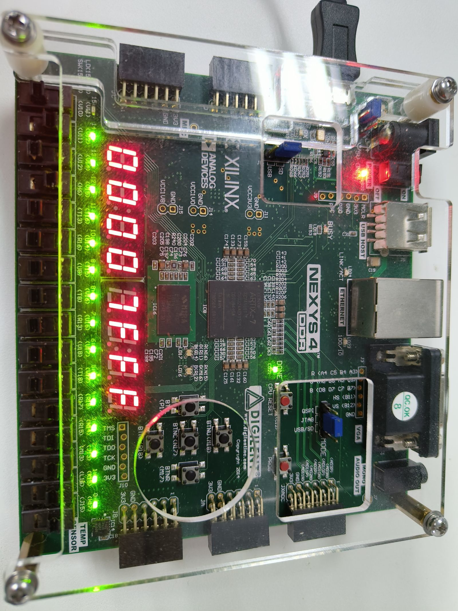

# Lab3 算术逻辑部件实验

> 金文泽 221220028

## 实验内容

1. 带标志位的加减运算部件
2. 桶形移位器
3. 32位ALU

## 1.带标志位的加减运算部件

### 实验方案设计

本部分需要实现4个模块，分别为：

1. 带标志位的全加器`FA_PG`
2. 4位先行进位模块`CLU`
3. 4位先行进位加法器`CLA_Group`
4. 16位先行进位加法器`CLA_16`
5. 带标志位的32位加法器`Adder32`

具体的实验步骤如下：

1. 使用Vivado创建一个新工程。
2. 点击添加设计源码文件，加入lab3.zip里的Adder32.v文件。
3. 点击添仿真测试文件，加入lab3.zip里的Adder32_tb.v文件。
4. 根据实验要求，完成源码文件的设计。
5. 对工程进行仿真测试，分析输入输出时序波形和控制台信息。

### 各模块设计方案

```verilog
module Adder32(
    output [31:0] f,
    output OF, SF, ZF, CF,
    output cout,
    input [31:0] x, y,
    input sub
	);

    wire carry;
    wire [31:0] real_y;
    assign real_y = sub ? ~y : y ;
    CLA_16 cla16_0(f[15:0], carry, x[15:0], real_y[15:0], sub);
    CLA_16 cla16_1(f[31:16], cout, x[31:16], real_y[31:16], carry);
    assign ZF = (f == 32'd0);
    assign SF = f[31];
    assign CF = sub ^ cout;
    assign OF = (~x[31] & ~y[31] & f[31]) | (x[31] & y[31] & ~f[31]);

endmodule


module CLA_16(
    output wire [15:0] f,
    output wire  cout, 
    input [15:0] x, y,
    input cin
    );

    wire [3:0] Pi,Gi; // 4 位组间进位传递因子和生成因子
    wire [4:0] c; // 4 位组间进位和整体进位
    assign c[0] = cin;
    CLA_group cla0(f[3:0],Pi[0],Gi[0],x[3:0],y[3:0],c[0]);
    CLA_group cla1(f[7:4],Pi[1],Gi[1],x[7:4],y[7:4],c[1]);
    CLA_group cla2(f[11:8],Pi[2],Gi[2],x[11:8],y[11:8],c[2]);
    CLA_group cla3(f[15:12],Pi[3],Gi[3],x[15:12],y[15:12],c[3]);
    CLU clu(c[4:1],Pi,Gi, c[0]);
    assign cout = c[4];

endmodule


module CLA_group (
    output [3:0] f,
    output pg,gg,
    input [3:0] x, y,
    input cin
    );

    wire [4:0] c;
    wire [4:1] p, g;
    assign c[0] = cin;
    FA_PG fa0(f[0], p[1], g[1],x[0], y[0], c[0]);
    FA_PG fa1(f[1], p[2], g[2],x[1], y[1], c[1]);
    FA_PG fa2(f[2], p[3], g[3],x[2], y[2], c[2]);
    FA_PG fa3(f[3], p[4], g[4],x[3], y[3], c[3]);
    CLU clu(c[4:1],p, g, c[0]);
    assign pg=p[1] & p[2] & p[3] & p[4];
    assign gg= g[4] | (p[4] & g[3]) | (p[4] & p[3] & g[2]) | (p[4] & p[3] & p[2] & g[1]);

endmodule

module CLU (
    output [4:1] c,
    input [4:1] p, g,
    input c0
    );

    assign c[1] = g[1] | (p[1] & c0);
    assign c[2] = g[2] | (p[2] & g[1]) | (p[2] & p[1] & c0);
    assign c[3] = g[3] | (p[3] & g[2]) | (&{p[3:2], g[1]}) | (&{p[3:1], c0});
    assign c[4] = g[4] | (p[4] & g[3]) | (&{p[4:3], g[2]}) | (&{p[4:2], g[1]}) | (&{p[4:1], c0});

endmodule


//Full Adder with PG
module FA_PG (
    output f, p, g,
    input x, y, cin
	);

    assign f = x ^ y ^ cin;
    assign p = x | y;
    assign g = x & y;

endmodule
```

### 仿真测试验证

利用仿真测试程序对模块进行仿真测试验证，测试文件如下：

```verilog
module Adder32_tb(    );
  parameter N = 32;      // Operand widths
  reg [31:0] SEED = 1;    // Change for a different random sequence
  reg [N-1:0] A, B;
  reg CIN;
  wire [N-1:0] S;
  wire COUT;
  wire OF,SF,ZF,CF;
  integer i, errors;
  reg xpectCF;
  reg [N-1:0] xpectS;

  Adder32 adder_inst(.f(S),.OF(OF),.SF(SF),.ZF(ZF),.CF(CF),.cout(COUT),.x(A),.y(B),.sub(CIN));
  
  task checkadd;
    begin
       {xpectCF,xpectS} = (CIN ? (A-B):(A+B));          //Verilog 加减运算结果比操作数增加1位，表示进位和借位。CIN=1表示减法运算
      if ( (xpectCF!==CF) || (xpectS!==S) ) begin
        errors = errors + 1;
        $display("ERROR: CIN,A,B = %1b,%8h,%8h, CF,S = %1b,%8h, should be %1b,%8h, OF,SF,ZF,COUT=%1b, %1b, %1b, %1b." ,
                 CIN, A, B, CF, S, xpectCF, xpectS ,OF,SF,ZF,COUT);
      end
      if ((B==A) && (CIN==1)&&(ZF==0 )) begin
        errors = errors + 1;
        $display("ERROR: CIN,A,B = %1b,%8h,%8h, CF,S = %1b,%8h, should be %1b,%8h, OF,SF,ZF,COUT=%1b, %1b, %1b, %1b." ,
                 CIN, A, B, CF, S, xpectCF, xpectS ,OF,SF,ZF,COUT);
      end
      if (((B[N-1]&A[N-1]&~S[N-1]) |(~A[N-1]&~B[N-1]&S[N-1]))  & (OF==0 )) begin
        errors = errors + 1;
        $display("ERROR: CIN,A,B = %1b,%8h,%8h, CF,S = %1b,%8h, should be %1b,%8h, OF,SF,ZF,COUT=%1b, %1b, %1b, %1b." ,
                 CIN, A, B, CF, S, xpectCF, xpectS ,OF,SF,ZF,COUT);
      end
    end
  endtask
  
  initial begin
    errors = 0;
           A = $random(SEED);                  // Set pattern based on seed parameter
   for (i=0; i<10000; i=i+1) begin             //计算10000次
          B = ~A; CIN = 0;  #10 ; checkadd;    // B是A的反码，相加
          B = ~A; CIN = 1;  #10 ; checkadd;    // B是A的反码，相减
          B = A;  CIN = 1;  #10 ; checkadd;    // 相等做减法，判断ZF
          A = $random; B= $random;                          
          CIN = 0; #10 ; checkadd;          // Check again
          CIN = 1; #10 ; checkadd;          // Try both values of CIN
    end
    $display("Adder32 test done. Errors: %0d .", errors);
    $stop(1);
  end

endmodule
```

运行仿真测试，结束后控制台输出如下

```console
Adder32 test done. Errors: 0 .
Adder32_tb.v:70: $stop(1) called at 500000000 (1ps)
```

说明仿真测试已经全部运行完毕并且没有错误，该模块的设计完成

### 实验结果

通过对计算过程的分级抽象，最终实现了一个32位加法器模块，同时在这个模块中，使用了两个16位先行进位加法器，加快计算速度的同时又不至于使硬件的规模非常庞大，实现了一定程度上的平衡。

## 2.桶型移位器

### 实验方案设计

本部分需要实现1个模块，分别为：

1. 桶形移位器`barrelsft32`

具体的实验步骤如下：

1. 使用Vivado创建一个新工程。
2. 点击添加设计源码文件，加入lab3.zip里的barrelsft32.v文件。
3. 点击添仿真测试文件，加入lab3.zip里的barrelsft32_tb.v文件。
4. 根据实验要求，完成源码文件的设计。
5. 对工程进行仿真测试，分析输入输出时序波形和控制台信息。
6. 将设计好的模块添加到上一部分的工程中，进行综合和实现，生成比特流文件。

### 各模块设计方案

```verilog
module barrelsft32(
    output [31:0] dout,
    input [31:0] din,
    input [4:0] shamt,     //移动位数
    input LR,           // LR=1时左移，LR=0时右移
    input AL      // AL=1时算术右移，AR=0时逻辑右移
	);

    wire [31:0] ALR;
    assign ALR = din[31] ? (din >> shamt) | (32'hFFFFFFFF << (32 - shamt)) : din >> shamt;
    assign dout = LR ? din << shamt : (AL ? ALR : din >> shamt);

endmodule
```

### 仿真测试验证

利用仿真测试程序对模块进行仿真测试验证，测试文件如下：

```verilog
module barrelsft32_tb(    );
  parameter N = 32;      // Operand widths
  reg [31:0] SEED = 1;    // Change for a different random sequence
  reg [N-1:0] A;
  reg [4:0] B;
  reg CIN;
  wire [N-1:0] S;
  wire COUT;
  wire OF,SF,ZF,CF;
  integer i, errors;
  reg xpectCF;
  reg [N-1:0] xpectS;

  barrelsft32 barrelsft32_inst(.dout(S),.din(A),.shamt(B),.LR(CIN),.AL(COUT));
  
  task checkadd;
	begin
	   {xpectCF,xpectS} = (CIN ? (A<<B):(A>>B));          //Verilog 加减运算结果比操作数增加1位，表示进位和借位。CIN=1表示减法运算
	  if ( (xpectCF!==COUT) || (xpectS!==S) ) begin
		errors = errors + 1;
		$display("ERROR: CIN,A,B = %1b,%8h,%8h, CF,S = %1b,%8h, should be %1b,%8h, OF,SF,ZF,COUT=%1b, %1b, %1b, %1b." ,
				 CIN, A, B, COUT, S, xpectCF, xpectS ,OF,SF,ZF,COUT);
	  end
	  if ((B==A) && (CIN==1)&&(ZF==0 )) begin
		errors = errors + 1;
		$display("ERROR: CIN,A,B = %1b,%8h,%8h, CF,S = %1b,%8h, should be %1b,%8h, OF,SF,ZF,COUT=%1b, %1b, %1b, %1b." ,
				 CIN, A, B, COUT, S, xpectCF, xpectS ,OF,SF,ZF,COUT);
	  end
	  if (((B[N-1]&A[N-1]&~S[N-1]) |(~A[N-1]&~B[N-1]&S[N-1]))  & (OF==0 )) begin
		errors = errors + 1;
		$display("ERROR: CIN,A,B = %1b,%8h,%8h, CF,S = %1b,%8h, should be %1b,%8h, OF,SF,ZF,COUT=%1b, %1b, %1b, %1b." ,
				 CIN, A, B, COUT, S, xpectCF, xpectS ,OF,SF,ZF,COUT);
	  end
	end
	  endtask
  
  initial begin
	errors = 0;
		   A = $random(SEED);                  // Set pattern based on seed parameter
   for (i=0; i<10000; i=i+1) begin             //计算10000次
		  B = $random; CIN = 0;  #10 ; checkadd;    // B是A的反码，相加
		  B = $random; CIN = 1;  #10 ; checkadd;    // B是A的反码，相减
		  B = $random;  CIN = 1;  #10 ; checkadd;    // 相等做减法，判断ZF
		  A = $random; B= $random;                          
		  CIN = 0; #10 ; checkadd;          // Check again
		  CIN = 1; #10 ; checkadd;          // Try both values of CIN
	end
	$display("barrelsft32 test done. Errors: %0d .", errors);
	$stop(1);
  end
```

运行仿真测试，结束后控制台输出如下

```console
barrelsft32 test done. Errors: 0 .
barrelsft32_tb.v:70: $stop(1) called at 500000000 (1ps)
```

说明仿真测试已经全部运行完毕并且没有错误，该模块的设计完成

### 实验结果

通过对计算过程的分级抽象，最终实现了一个32位桶形移位器模块，该模块可以实现逻辑左移、逻辑右移、算术左移、算术右移。

## 3.32位ALU

### 实验方案设计

本部分需要实现2个模块，分别为：

1. 32位ALU`ALU32`
2. 32位ALU测试顶层`ALU32_top`

具体的实验步骤如下：

1. 使用Vivado创建一个新工程。
2. 点击添加设计源码文件，加入lab3.zip里的ALU32.v文件。
3. 点击添仿真测试文件，加入lab3.zip里的ALU32_tb.v文件。
4. 根据实验要求，完成源码文件的设计。
5. 对工程进行仿真测试，分析输入输出时序波形和控制台信息。
6. 将设计好的模块添加到ALU32_top工程中，进行综合和实现，生成比特流文件。
7. 将比特流文件下载到开发板上，进行验证。

### 各模块设计方案

#### ALU32模块设计

```verilog
module ALU32(
    output  [31:0] result,      //32位运算结果
    output  zero,               //结果为0标志位
    input   [31:0] dataa,       //32位数据输入，送到ALU端口A   
    input   [31:0] datab,       //32位数据输入，送到ALU端口B  
    input   [3:0] aluctr        //4位ALU操作控制信号
    ); 

    reg [31:0] _result;
    assign result = _result;

    reg sub;
    wire [31:0] adder_result;
    wire OF, SF, ZF, CF;
    wire real_OF;
    wire [31:0] real_y;
    assign _zero = ZF;
    wire cout;
    assign  real_y = sub ? ~datab : datab;
    assign real_OF = (~dataa[31] & ~real_y[31] & adder_result[31]) | (dataa[31] & real_y[31] & ~adder_result[31]);

    wire [31:0] sft_result;
    reg LR, AL;

    reg SIG;
    wire [31:0] cmp_result;
    assign cmp_result = {31'b0, (SIG ? (real_OF ^ SF) : CF)};

    Adder32 my_adder(adder_result, OF, SF, ZF, CF, cout, dataa, datab, sub);

    barrelsft32 my_barrel(sft_result, dataa, datab[4:0], LR, AL);

    always @(*) begin
        case(aluctr) 
            4'b0000: begin  //and
                sub = 0;
                _result = adder_result;
            end
            4'b0001: begin  //left shift
                LR = 1; AL = 0;
                _result = sft_result;
            end
            4'b0010: begin  //signed cmp
                sub = 1; SIG = 1;
                _result = cmp_result;
            end
            4'b0011: begin  //unsigned cmp
                sub = 1; SIG = 0;
                _result = cmp_result;
            end
            4'b0100: begin  //xor
                _result = dataa ^ datab;
            end
            4'b0101: begin  //right shift
                LR = 0; AL = 0;
                _result = sft_result;
            end
            4'b0110: begin
                _result = dataa | datab;
            end
            4'b0111: begin
                _result = dataa & datab;
            end
            4'b1000: begin  //sub
                sub = 1;
                _result = adder_result;
            end
            4'b1101: begin  //al right shift
                LR = 0; AL = 1;
                _result = sft_result;
            end
            4'b1111: begin //load imm(datab)
                _result = datab;
            end
            default: begin
                _result = 32'd0;
            end
        endcase
    end

endmodule
```

#### ALU32_top模块设计

```verilog
module ALU32_top(
    output [6:0] segs,           //七段数码管字形输出
    output [7:0] AN,            //七段数码管显示32位运算结果 
    output  [15:0] result_l,       //32位运算结果
    output  zero,             //结果为0标志位
    input   [3:0] data_a,           //4位数据输入，重复8次后送到ALU端口A   
    input   [3:0] data_b,           //4位数据输入，重复8次后送到ALU端口B  
    input   [3:0] aluctr,        //4位ALU操作控制信号
    input   clk
    ); 

    reg [3:0] dis_cur;
    reg [3:0] dis_pos;
    dec7seg led_driver(segs, AN, dis_cur, dis_pos);

    wire [31:0] result_32;

    assign result_l = result_32[15:0];

    wire [31:0] dataa;
    wire [31:0] datab;
    assign dataa = {8{data_a}};
    assign datab = {8{data_b}};

    ALU32 alu(result_32, zero, dataa, datab, aluctr);

    //display buffer
    wire [3:0] display_buffer [0:7];
    assign display_buffer[0] = result_32[3:0];
    assign display_buffer[1] = result_32[7:4];
    assign display_buffer[2] = result_32[11:8];
    assign display_buffer[3] = result_32[15:12];
    assign display_buffer[4] = result_32[19:16];
    assign display_buffer[5] = result_32[23:20];
    assign display_buffer[6] = result_32[27:24];
    assign display_buffer[7] = result_32[31:28];
    reg [15:0] trans;
    reg [3:0] dis_cnt;

    //Display driving loop
    always @(posedge clk) begin
        //Transfer clk signal to acceptable fresh rate.
        if(trans >= 16'd50000)
            trans <= 0;
        else
            trans <= trans + 1;
            
        if(trans == 0) begin
            if(dis_cnt >= 7)
                dis_cnt <= 0;
            else
                dis_cnt <= dis_cnt + 1;
        end
        
        //Display
        dis_pos <= dis_cnt;
        dis_cur <= display_buffer[dis_cnt];
    end


endmodule
```

### 仿真测试验证

利用仿真测试程序对模块进行仿真测试验证，测试文件如下：

```verilog
module ALU32_tb(    );
  parameter N = 32;               // 定义位宽
  reg [31:0] SEED = 1;              // 定义不同的随机序列
  wire [N-1:0] Result;              //32位运算结果
  wire zero;                         //结果为0标志位
  reg [N-1:0]  Data_A, Data_B;     //32位数据输入,送到ALU端口A
  reg [3:0]   ALUctr;             //4位ALU操作控制信号
  integer i, errors;
  reg [N-1:0] TempS;
  reg [4:0] shamt;
//  reg tempZero;
  reg less;
  reg signed [31:0] tempdata_a,tempdata_b;
  
  parameter Addctr  = 4'b0000,   // 定义不同运算的控制码
             Sllctr  = 4'b0001, 
             Sltctr  = 4'b0010, 
             Sltuctr = 4'b0011, 
             Xorctr  = 4'b0100, 
             Srlctr  = 4'b0101, 
             Orctr   = 4'b0110, 
             Andctr  = 4'b0111, 
             Subctr  = 4'b1000, 
             Sractr  = 4'b1101, 
             Luictr  = 4'b1111; 


ALU32 ALU32_inst(.result(Result),.zero(zero),.dataa(Data_A),.datab(Data_B),.aluctr(ALUctr));

  task checkalu;
    begin
    case (ALUctr)
    Addctr: begin 
                 TempS=Data_A+Data_B;   //加法运算
                 if (TempS!=Result) 
                  begin     
                       errors = errors + 1;
                      $display("ERROR: ALUctr,Data_A,Data_B = %4b,%8h,%8h, want= %8h, got=%8h,%1b." ,
                      ALUctr, Data_A, Data_B, TempS, Result,zero);                 
                  end
             end
    Sllctr: begin 
                 shamt=Data_B[4:0];
                 TempS=Data_A << shamt;   //左移运算
                 if (TempS!=Result) 
                  begin     
                       errors = errors + 1;
                      $display("ERROR: ALUctr,Data_A,Data_B = %4b,%8h,%8h, want= %8h, got=%8h,%1b." ,
                      ALUctr, Data_A, Data_B, TempS, Result,zero);                 
                  end
             end
    Sltctr: begin                 //带符号数小于比较运算
                 tempdata_a=Data_A;
                 tempdata_b=Data_B;
                 less=tempdata_a < tempdata_b;
                 TempS={28'h0000000,3'b000,less};
                 if (TempS!=Result)
                  begin     
                       errors = errors + 1;
                      $display("ERROR: ALUctr,Data_A,Data_B = %4b,%8h,%8h, want= %8h, got=%8h,%1b." ,
                      ALUctr, Data_A, Data_B, TempS, Result,zero);                 
                  end
             end
    Sltuctr: begin                 //无符号数小于比较运算
                 less=Data_A < Data_B;
                 TempS={28'h0000000,3'b000,less};
                 if (TempS!=Result)
                  begin     
                       errors = errors + 1;
                      $display("ERROR: ALUctr,Data_A,Data_B = %4b,%8h,%8h, want= %8h, got=%8h,%1b." ,
                      ALUctr, Data_A, Data_B, TempS, Result,zero);                 
                  end
             end
      Xorctr: begin 
                 TempS=Data_A ^ Data_B;   //异或运算
                 if (TempS!=Result) 
                  begin     
                       errors = errors + 1;
                      $display("ERROR: ALUctr,Data_A,Data_B = %4b,%8h,%8h, want= %8h, got=%8h,%1b." ,
                      ALUctr, Data_A, Data_B, TempS, Result,zero);                 
                  end
             end
      Srlctr: begin 
                 shamt=Data_B[4:0];
                 TempS=Data_A >> shamt;   //逻辑右移运算
                 if (TempS!=Result) 
                  begin     
                       errors = errors + 1;
                      $display("ERROR: ALUctr,Data_A,Data_B = %4b,%8h,%8h, want= %8h, got=%8h,%1b." ,
                      ALUctr, Data_A, Data_B, TempS, Result,zero);                 
                  end
             end
      Orctr: begin 
                 TempS=Data_A | Data_B;   //或运算
                 if (TempS!=Result) 
                  begin     
                       errors = errors + 1;
                      $display("ERROR: ALUctr,Data_A,Data_B = %4b,%8h,%8h, want= %8h, got=%8h,%1b." ,
                      ALUctr, Data_A, Data_B, TempS, Result,zero);                 
                  end
             end
      Andctr: begin 
                 TempS=Data_A & Data_B;   //与运算
                 if (TempS!=Result) 
                  begin     
                       errors = errors + 1;
                      $display("ERROR: ALUctr,Data_A,Data_B = %4b,%8h,%8h, want= %8h, got=%8h,%1b." ,
                      ALUctr, Data_A, Data_B, TempS, Result,zero);                 
                  end
             end
      Subctr: begin 
                 TempS=Data_A-Data_B;   //减法运算
                 if (TempS!=Result) 
                  begin     
                       errors = errors + 1;
                      $display("ERROR: ALUctr,Data_A,Data_B = %4b,%8h,%8h, want= %8h, got=%8h,%1b." ,
                      ALUctr, Data_A, Data_B, TempS, Result,zero);                 
                  end
             end
      Sractr: begin 
                 shamt=Data_B[4:0];
                 TempS=tempdata_a >>> shamt;   //算术右移运算
                 if (TempS!=Result) 
                  begin     
                       errors = errors + 1;
                      $display("ERROR: ALUctr,Data_A,Data_B = %4b,%8h,%8h, want= %8h, got=%8h,%1b." ,
                      ALUctr, Data_A, Data_B, TempS, Result,zero);                 
                  end
             end
    Luictr: begin 
                 TempS=Data_B;   //取操作数B
                 if (TempS!=Result) 
                  begin     
                       errors = errors + 1;
                      $display("ERROR: ALUctr,Data_A,Data_B = %4b,%8h,%8h, want= %8h, got=%8h,%1b." ,
                      ALUctr, Data_A, Data_B, TempS, Result,zero);                 
                  end
             end
           
             
    endcase
    end
  endtask
  
  initial begin
    errors = 0;
           Data_A = $random(SEED);                        // Set pattern based on seed parameter
   for (i=0; i<10000; i=i+1) begin                //计算10000次
          Data_B = ~Data_A; 
          ALUctr = Addctr;  #10 ; checkalu;     
          ALUctr = Sllctr;  #10 ; checkalu;     
          ALUctr = Sltctr;  #10 ; checkalu;     
          ALUctr = Sltuctr; #10 ; checkalu;     
          ALUctr = Xorctr;  #10 ; checkalu;     
          ALUctr = Srlctr;  #10 ; checkalu;     
          ALUctr = Orctr;   #10 ; checkalu;     
          ALUctr = Subctr;  #10 ; checkalu;     
          ALUctr = Sractr;  #10 ; checkalu;     
          ALUctr = Luictr;  #10 ; checkalu;     
          Data_B = Data_A; 
          ALUctr = Addctr;  #10 ; checkalu;     
          ALUctr = Sllctr;  #10 ; checkalu;     
          ALUctr = Sltctr;  #10 ; checkalu;     
          ALUctr = Sltuctr; #10 ; checkalu;     
          ALUctr = Xorctr;  #10 ; checkalu;     
          ALUctr = Srlctr;  #10 ; checkalu;     
          ALUctr = Orctr;   #10 ; checkalu;     
          ALUctr = Subctr;  #10 ; checkalu;     
          ALUctr = Sractr;  #10 ; checkalu;     
          ALUctr = Luictr;  #10 ; checkalu;     
          Data_A = $random; Data_B= $random;                          // Get random number, maybe > 32 bits wide
          ALUctr = Addctr;  #10 ; checkalu;     
          ALUctr = Sllctr;  #10 ; checkalu;     
          ALUctr = Sltctr;  #10 ; checkalu;     
          ALUctr = Sltuctr; #10 ; checkalu;     
          ALUctr = Xorctr;  #10 ; checkalu;     
          ALUctr = Srlctr;  #10 ; checkalu;     
          ALUctr = Orctr;   #10 ; checkalu;     
          ALUctr = Subctr;  #10 ; checkalu;     
          ALUctr = Sractr;  #10 ; checkalu;     
          ALUctr = Luictr;  #10 ; checkalu;     
    end
    $display("ALU32 test done. Errors: %0d .", errors);
    $stop(1);
  end
endmodule
```

运行仿真测试，结束后控制台输出如下

```console
ALU32 test done. Errors: 0 .
ALU32_tb.v:70: $stop(1) called at 500000000 (1ps)
```

说明仿真测试已经全部运行完毕并且没有错误。

### 开发板验证

通过综合和实现，生成比特流文件，下载到开发板上，进行验证。

验证过程中的图片如下





通过上述在开发板上的验证，可以看到，该32位ALU模块的设计是正确的。

### 实验总结

通过对32位ALU模块的学习与设计，我对ALU的工作原理有了更深入的了解，同时也对Verilog语言的使用有了更深入的认识。

## 思考题

### 1.分析32 位 ALU 的资源占用情况。

| 资源类型 | 使用数量 | 可用数量 | 使用率 |
| -------- | -------- | -------- | ------ |
| LUT      |  106     |  63400   |  0.17% |
| FF       |  64      |  126800  |  0.05% |
| DSP      |  0       |  240     |  0.00% |
| BRAM     |  0       |  240     |  0.00% |

### 2.如果比较运算直接使用组合电路比较器来实现，则 32 位ALU 电路原理图需要做哪些修改？

需要修改ALU32模块中的Sltctr和Sltuctr的实现，将其改为组合电路比较器的实现。

### 3.在32 位ALU 的基础上如何实现 64 位的ALU？

在32位ALU的基础上，将其扩展为64位ALU，只需要将其中的32位数据扩展为64位数据即可。

### 4.查找资料说明还有哪些并行加法器的设计方法，并详细介绍其中一种方法。


