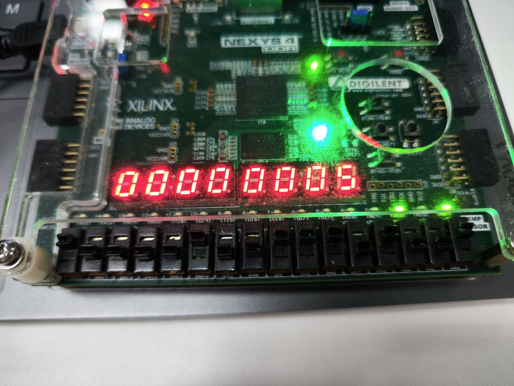
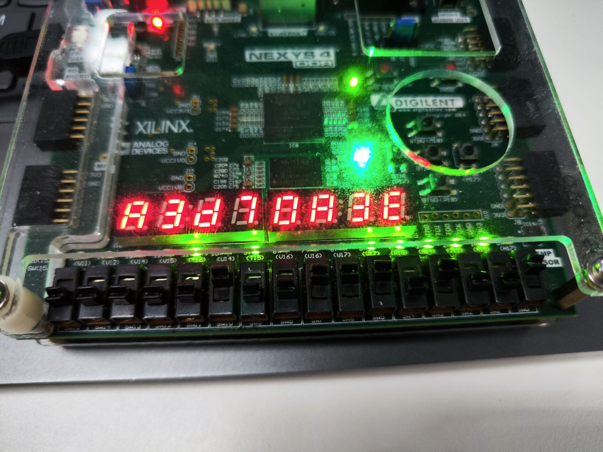
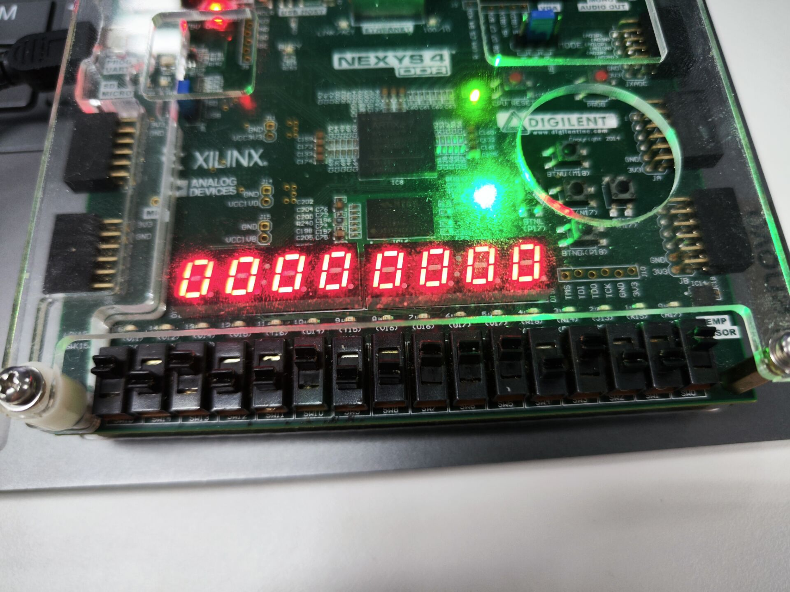
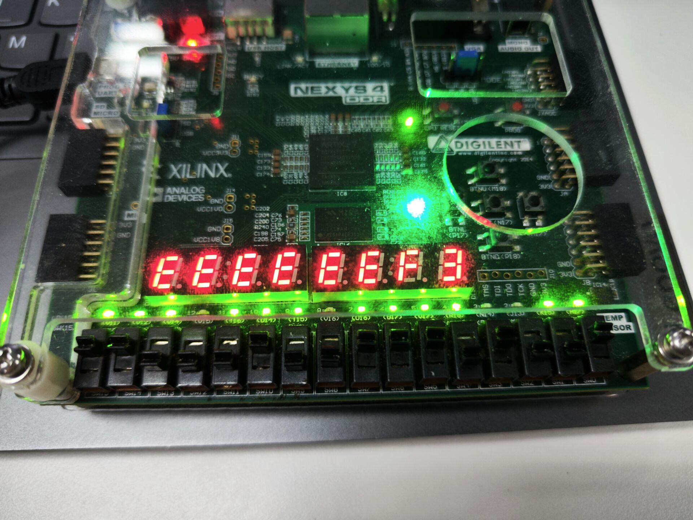
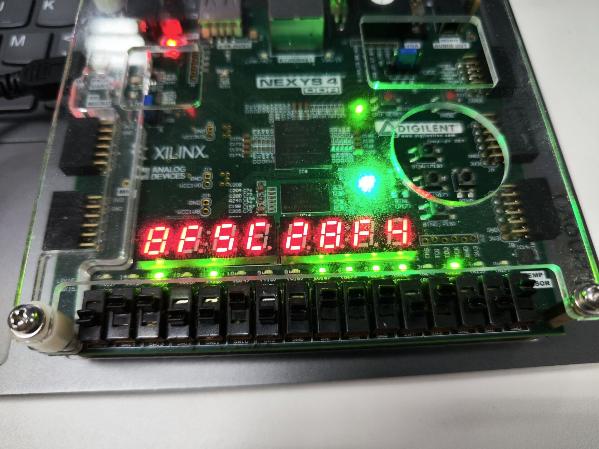
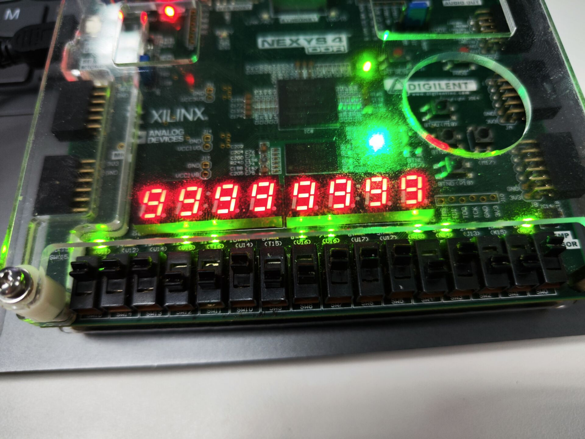
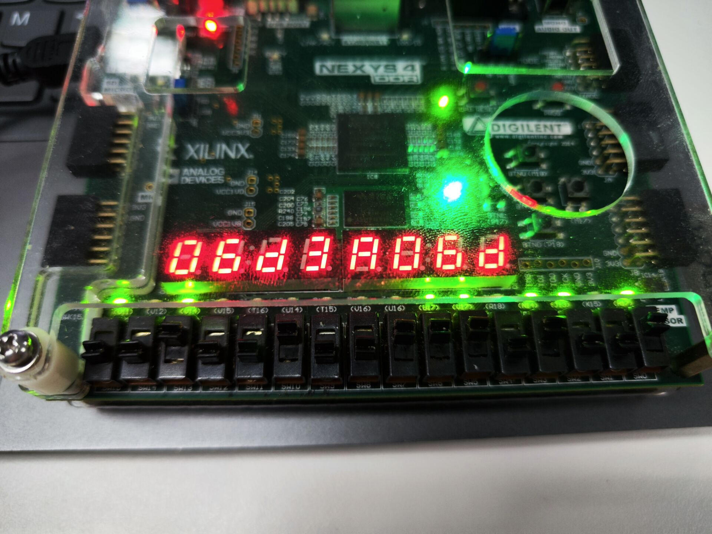
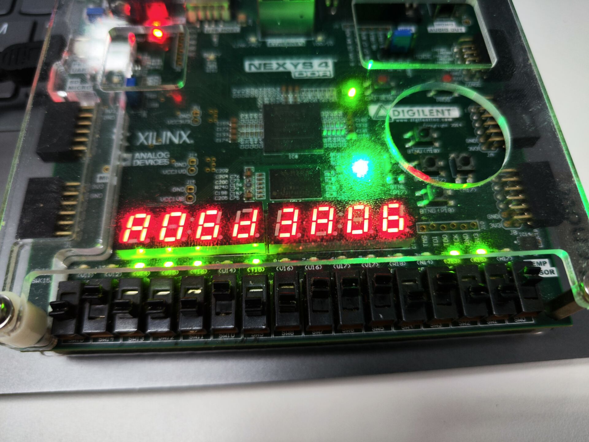
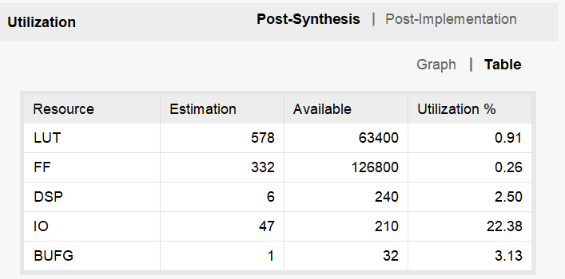

# Lab4 乘除法器实验

> 金文泽 221220028

## 实验内容

1. 补码1位乘法器设计
2. 快速乘法器
3. 补码除法器
4. RV32M指令实现

## 1. 补码1位乘法器设计

### 实验方案设计

本部分需要实现1个模块，为：

1. 补码1位乘法器部件`mul_32b`

本部分需要利用之前实现过的一个部件，为：

1. 32位加法器`Adder32`

具体的实验步骤如下：

1. 使用Vivado创建一个新工程。
2. 点击添加设计源码文件，加入`lab4.zip`里的`mul_32b.v`文件。
3. 点击添加仿真测试文件，加入`lab4.zip`里的`mul_32b_tb.v`文件。
4. 点击添加设计源码文件，加入`lab3.zip`里的`Adder32.v`文件。
5. 根据实验要求，完成源码文件的设计。
6. 对工程进行仿真测试，分析输入输出时序波形和控制台信息。

### 各模块设计方案

`Adder32`部件的设计在Lab3中就已经完成，在此处不再赘述。接下来给出`mul_32b`部件的设计方案。

```verilog
module mul_32b(
    output [63:0] p,         //乘积
    output out_valid,        //高电平有效时，表示乘法器结束工作
    input clk,              //时钟 
    input rst_n,             //复位信号，低有效
    input [31:0] x,           //被乘数
    input [31:0] y,           //乘数
    input in_valid           //高电平有效，表示乘法器开始工作
); 
    //寄存器
    reg [5:0] cnt;     //移位次数寄存器
    reg [63:0] buffer;      //乘积寄存器
    reg [31:0] op1;         //被乘数寄存器
    reg bufferbooth;        //乘积寄存器的-1位

    //组合逻辑
    wire [1:0] op;          //Booth编码
    wire cout;              //加法器的进位
    wire [31:0] rx, ry; //加法器的两个输入和部分积寄存器
    wire [31:0] Add_result;        //加法器的输出
    assign op = {buffer[0], bufferbooth}; //Booth编码
    assign ry = op1;
    assign rx = buffer[63:32];
    assign p = buffer;
    assign out_valid = (cnt == 0);

    //加法器
    Adder32 adder32_1(
        .x(rx),
        .y((op == 2'b00 || op == 2'b11)? 32'd0 : ry),
        .sub(op == 2'b10),
        .f(Add_result),
        .cout(cout)
    );

    always @(posedge clk or negedge rst_n) begin
        if(!rst_n) begin
            cnt <= 0;
            buffer <= 0;
            op1 <= 0;
            bufferbooth <= 0;
        end
        else if(in_valid) begin
            cnt <= 32;
            buffer <= {32'd0, y};
            op1 <= x;
            bufferbooth <= 0;
        end
        else if(cnt > 0) begin
            cnt <= cnt - 1;
            buffer <= {Add_result[31], Add_result, buffer[31:1]};
            bufferbooth <= buffer[0];
        end
    end
endmodule
```

### 仿真测试结果

通过对给出的测试文件进行一定的修改，得到最终的测试文件如下：

```verilog
module mul_32b_tb(   );
    parameter N = 32;               // 定义位宽
    reg [31:0] SEED = 1;              // 定义不同的随机序列
    reg clk, rst;
    reg signed [N-1:0] x, y;
    reg in_valid;
    wire [2*N-1:0] p;
    wire  out_valid;

    mul_32b my_mul_32u (.clk(clk),.rst_n(!rst),.x(x[31:0]),.y(y[31:0]),.in_valid(in_valid),.p(p),.out_valid(out_valid)); // 
  
    reg signed [2*N-1:0] temp_P;
    integer i, errors;
    task checkP;
        begin
        temp_P = x*y;
        if (out_valid &&(temp_P != p)) begin
            errors=errors+1;
            $display($time," Error: x=%8h, y=%8h, expected %16h (%d), got %16h (%d)",
                    x, y, temp_P, temp_P, p, p); 
            end
            else begin
            $display($time," Correct: x=%8h, y=%8h, expected %16h (%d), got %16h (%d)",
                    x, y, temp_P, temp_P, p, p); 
            end
        end
    endtask


    initial begin : TB   // Start testing at time 0
        clk = 0;
        forever 
        #2 clk = ~clk;	     //
    end

    initial 
    begin	
        errors = 0;
        x = $random(SEED);                        // Set pattern based on seed parameter
        for (i=0; i<10000; i=i+1) begin                //计算10000次
            rst = 1'b0;
            #2
            rst = 1'b1;                             //上电后1us复位信号
            x=$random; y=$random;
            #2
            rst = 1'b0;	
            in_valid=1'b1;                        //初始化数据
            #5
            in_valid=1'b0;
            #150;	                          // wait 150 ns, then check result
            checkP;
        end  
        $display($time, " Multipler32B test end. Errors %d .",errors); 
        $stop(1);          // end test
    end
endmodule
```

最终，使用如下命令利用iverilator进行仿真测试

```zsh
iverilator -o sim1 mul_32b.v mul_32b_tb.v Adder32.v
vvp sim1
```

得到仿真结果终端输出如下：

```console
 Multipler32B test end. Errors 0 .
```

说明该部件的设计已经完成并通过测试。

## 2. 快速乘法器

### 实验方案设计

本部分需要实现1个模块，为：

1. 快速乘法器部件`mul_32k`

### 各模块设计方案 

快速乘法器的设计方案如下：

```verilog
module mul_32k(
  input [31:0] X, Y,
  output [63:0] P       // output variable for assignment
  );
//add your code here  

reg [63:0] temp;
    reg [63:0] stored0;
    reg [63:0] stored1;
    reg [63:0] stored2;
    reg [63:0] stored3;
    reg [63:0] stored4;
    reg [63:0] stored5;
    reg [63:0] stored6;
    reg [63:0] stored7;
    reg [63:0] stored8;
    reg [63:0] stored9;
    reg [63:0] stored10;
    reg [63:0] stored11;
    reg [63:0] stored12;
    reg [63:0] stored13;
    reg [63:0] stored14;                    
    reg [63:0] stored15;
    reg [63:0] stored16;
    reg [63:0] stored17;
    reg [63:0] stored18;
    reg [63:0] stored19;
    reg [63:0] stored20;
    reg [63:0] stored21;
    reg [63:0] stored22;
    reg [63:0] stored23;
    reg [63:0] stored24;
    reg [63:0] stored25;
    reg [63:0] stored26;
    reg [63:0] stored27;
    reg [63:0] stored28;
    reg [63:0] stored29;
    reg [63:0] stored30;
    reg [63:0] stored31;
    
    reg [63:0] add0_1;
    reg [63:0] add2_3;
    reg [63:0] add4_5;
    reg [63:0] add6_7;
    reg [63:0] add8_9;
    reg [63:0] add10_11;
    reg [63:0] add12_13;
    reg [63:0] add14_15;
    reg [63:0] add16_17;                    
    reg [63:0] add18_19;
    reg [63:0] add20_21;
    reg [63:0] add22_23;
    reg [63:0] add24_25;
    reg [63:0] add26_27;
    reg [63:0] add28_29;
    reg [63:0] add30_31;
    
    reg [63:0] add0t1_2t3;
    reg [63:0] add4t5_6t7;
    reg [63:0] add8t9_10t11;
    reg [63:0] add12t13_14t15;
    reg [63:0] add16t17_18t19;
    reg [63:0] add20t21_22t23;
    reg [63:0] add24t25_26t27;                        
    reg [63:0] add28t29_30t31;
    
    reg [63:0] add0t1_2t3_4t5_6t7;
    reg [63:0] add8t9_10t11_12t13_14t15;
    reg [63:0] add16t17_18t19_20t21_22t23;
    reg [63:0] add24t25_26t27_28t29_30t31;
    
    reg [63:0] add0t1_2t3_4t5_6t7_8t9_10t11_12t13_14t15;
    reg [63:0] add16t17_18t19_20t21_22t23_24t25_26t27_28t29_30t31;
    
    always @(*)begin
        stored0<=Y[0]?{32'b0,X}:64'b0;
        stored1<=Y[1]?{31'b0,X,1'b0}:64'b0;
        stored2<=Y[2]?{30'b0,X,2'b0}:64'b0;
        stored3<=Y[3]?{29'b0,X,3'b0}:64'b0;
        stored4<=Y[4]?{28'b0,X,4'b0}:64'b0;
        stored5<=Y[5]?{27'b0,X,5'b0}:64'b0;
        stored6<=Y[6]?{26'b0,X,6'b0}:64'b0;
        stored7<=Y[7]?{25'b0,X,7'b0}:64'b0;
        stored8<=Y[8]?{24'b0,X,8'b0}:64'b0;
        stored9<=Y[9]?{23'b0,X,9'b0}:64'b0;
        stored10<=Y[10]?{22'b0,X,10'b0}:64'b0;
        stored11<=Y[11]?{21'b0,X,11'b0}:64'b0;
        stored12<=Y[12]?{20'b0,X,12'b0}:64'b0;
        stored13<=Y[13]?{19'b0,X,13'b0}:64'b0;
        stored14<=Y[14]?{18'b0,X,14'b0}:64'b0;
        stored15<=Y[15]?{17'b0,X,15'b0}:64'b0;
        stored16<=Y[16]?{16'b0,X,16'b0}:64'b0;
        stored17<=Y[17]?{15'b0,X,17'b0}:64'b0;
        stored18<=Y[18]?{14'b0,X,18'b0}:64'b0;
        stored19<=Y[19]?{13'b0,X,19'b0}:64'b0;
        stored20<=Y[20]?{12'b0,X,20'b0}:64'b0;
        stored21<=Y[21]?{11'b0,X,21'b0}:64'b0;
        stored22<=Y[22]?{10'b0,X,22'b0}:64'b0;
        stored23<=Y[23]?{9'b0,X,23'b0}:64'b0;
        stored24<=Y[24]?{8'b0,X,24'b0}:64'b0;
        stored25<=Y[25]?{7'b0,X,25'b0}:64'b0;
        stored26<=Y[26]?{6'b0,X,26'b0}:64'b0;
        stored27<=Y[27]?{5'b0,X,27'b0}:64'b0;
        stored28<=Y[28]?{4'b0,X,28'b0}:64'b0;
        stored29<=Y[29]?{3'b0,X,29'b0}:64'b0;
        stored30<=Y[30]?{2'b0,X,30'b0}:64'b0;
        stored31<=Y[31]?{1'b0,X,31'b0}:64'b0;
        
        add0_1<=stored0+stored1;
        add2_3<=stored2+stored3;
        add4_5<=stored4+stored5;
        add6_7<=stored6+stored7;
        add8_9<=stored8+stored9;
        add10_11<=stored10+stored11;
        add12_13<=stored12+stored13;
        add14_15<=stored14+stored15;
        add16_17<=stored16+stored17;
        add16_17<=stored16+stored17;
        add18_19<=stored18+stored19;
        add20_21<=stored20+stored21;
        add22_23<=stored22+stored23;
        add24_25<=stored24+stored25;
        add26_27<=stored26+stored27;
        add28_29<=stored28+stored29;
        add30_31<=stored30+stored31;
        
        add0t1_2t3<=add0_1+add2_3;
        add4t5_6t7<=add4_5+add6_7;
        add8t9_10t11<=add8_9+add10_11;
        add12t13_14t15<=add12_13+add14_15;
        add16t17_18t19<=add16_17+add18_19;
        add20t21_22t23<=add20_21+add22_23;
        add24t25_26t27<=add24_25+add26_27;
        add28t29_30t31<=add28_29+add30_31;
        
        add0t1_2t3_4t5_6t7<=add0t1_2t3+add4t5_6t7;
        add8t9_10t11_12t13_14t15<=add8t9_10t11+add12t13_14t15;
        add16t17_18t19_20t21_22t23<=add16t17_18t19+add20t21_22t23;
        add24t25_26t27_28t29_30t31<=add24t25_26t27+add28t29_30t31;
        
        add0t1_2t3_4t5_6t7_8t9_10t11_12t13_14t15<=add0t1_2t3_4t5_6t7+add8t9_10t11_12t13_14t15;
        add16t17_18t19_20t21_22t23_24t25_26t27_28t29_30t31<=add16t17_18t19_20t21_22t23+add24t25_26t27_28t29_30t31;

        temp<=add0t1_2t3_4t5_6t7_8t9_10t11_12t13_14t15+add16t17_18t19_20t21_22t23_24t25_26t27_28t29_30t31;

    end 
    
    assign P=temp;

endmodule
```

### 仿真测试结果

仿真测试文件如下

```verilog
module mul_32k_tb(    );
  parameter N = 32;               // 定义位宽
  reg [31:0] SEED = 1;              // 定义不同的随机序列
  reg [N-1:0] X, Y;
  wire [2*N-1:0] P;

  mul_32k UUT ( .X(X), .Y(Y), .P(P) ); // Instantiate the UUT

  task checkP;
    reg [2*N-1:0] temp_P;
    begin
      temp_P = X*Y;
      if (P !== temp_P) begin
        $display($time," Error: X=%d, Y=%d, expected %d (%16H), got %d (%16H)",
                 X, Y, temp_P, temp_P, P, P); $stop(1); end
    end
  endtask
    integer i;
  initial begin : TB   // Start testing at time 0

    X=$random(SEED);
    for ( i=0; i<=10000; i=i+1 ) begin
      X=$random;   Y=$random;
     #10;           // wait 10 ns, then check result
        checkP;
      end
    $display($time, " Test ended"); $stop(1);          // end test
  end

endmodule
```

最终，使用如下命令利用iverilator进行仿真测试

```zsh
iverilator -o sim2 mul_32k.v mul_32k_tb.v
vvp sim2
```

得到仿真结果终端输出如下：

```console
 Test ended
```

## 3. 补码除法器

### 实验方案设计

本部分需要实现1个模块，为：

1. 补码除法器部件`div_32b`

本部分需要利用之前实现过的一个部件，为：

1. 32位加法器`Adder32`

### 各模块设计方案

```verilog
module div_32b(
    output  [31:0] Q,          //商
    output  [31:0] R,          //余数
    output out_valid,        //除法运算结束时，输出为1
    output in_error,         //被除数或除数为0时，输出为1
    input clk,               //时钟 
    input rst,             //复位信号
    input [31:0] X,           //被除数
    input [31:0] Y,           //除数
    input in_valid          //输入为1时，表示数据就绪，开始除法运算
);

    reg [5:0] cnt;               //计数器
    reg [63:0] buffer;            //被除数寄存器
    reg temp_out_valid;         //输出有效信号
    reg initial_rsign;
    reg initial_ysign;
    assign in_error = ((X == 0) || (Y == 0)); //预处理，除数和被除数异常检测报错
    assign out_valid = temp_out_valid | in_error;
    assign Q = buffer[31:0];
    assign R = buffer[63:32];
    wire rsign;
    wire ysign;
    wire signed [31:0] y;
    wire signed [31:0] r;
    wire signed [31:0] q;
    assign y = Y;
    assign r = R;
    assign q = Q;
    assign rsign = buffer[63];
    assign ysign = Y[31];
    wire signed [31:0] diff_res, add_res, two_diff_res, two_add_res;
    assign diff_res = r - y;
    assign add_res = r + y;
    wire [31:0] qplusone;
    assign qplusone = q + 1;
    
    

    always @(posedge clk or negedge rst) begin
        if(!rst) begin
            buffer <= 0;
            cnt <= 0;
            temp_out_valid <= 0;
        end
        else if(in_valid) begin
            buffer <= {{32{X[31]}}, X};
            cnt <= 34;
            temp_out_valid <= 0;
            initial_rsign = X[31];
            initial_ysign = Y[31];
        end
        else if(cnt == 34) begin
            if(rsign == ysign) begin
                if(diff_res[31] == ysign) begin
                    buffer <= {diff_res[30:0], buffer[31:0], 1'b1};
                end else begin
                    buffer <= {diff_res[30:0], buffer[31:0], 1'b0};
                end
            end else begin
                if(add_res[31] == ysign) begin
                    buffer <= {add_res[30:0], buffer[31:0], 1'b1};
                end else begin
                    buffer <= {add_res[30:0], buffer[31:0], 1'b0};
                end
            end
            cnt <= cnt - 1;
        end
        else if(cnt > 2) begin
            if(buffer[0]) begin
                buffer <= {diff_res[30:0], buffer[31:0], (diff_res[31] == ysign? 1'b1 : 1'b0)};
            end else begin
                buffer <= {add_res[30:0], buffer[31:0], (add_res[31] == ysign? 1'b1 : 1'b0)};
            end
            cnt <= cnt - 1;
        end
        else if(cnt == 2) begin
            if(buffer[0]) begin
                buffer <= {diff_res[31:0], buffer[30:0], (diff_res[31] == ysign || diff_res == 0? 1'b1 : 1'b0)};
            end else begin
                buffer <= {add_res[31:0], buffer[30:0], (add_res[31] == ysign || add_res == 0? 1'b1 : 1'b0)};
            end
            cnt <= cnt - 1;
        end
        else if(cnt == 1) begin
            if(initial_rsign == initial_ysign || r == 0) begin    //商不需要修正
                if(rsign == initial_rsign || r == 0) begin        //余数不需要修正
                    buffer <= buffer;
                end else begin
                    buffer <= {add_res, buffer[31:0]};
                end
            end 
            else begin
                if(rsign == initial_rsign || r == 0) begin        //余数不需要修正
                    buffer <= {buffer[63:32], qplusone};
                end else begin
                    buffer <= {diff_res, qplusone};
                end
            end
            cnt <= cnt - 1;
            temp_out_valid <= 1;
        end
    end

endmodule
```

### 仿真测试结果

通过对给出的测试文件进行一定的修改，得到最终的测试文件如下：

```verilog
module div_32b_tb( );
    parameter N = 32;               // 定义位宽
    reg [31:0] SEED = 1;              // 定义不同的随机序列
    reg clk, rst;
    reg signed [N-1:0] x, y;
    reg in_valid;
    wire [N-1:0] q,r;
    wire  out_valid;
    wire  in_error;

    div_32b my_div_32b (.Q(q),.R(r),.out_valid(out_valid),.in_error(in_error),.clk(clk),.rst(~rst),.X(x),.Y(y),.in_valid(in_valid)); // 
  
    reg [N-1:0] temp_Q,temp_R;
    integer i, errors;
    task checkP;
    begin
    temp_Q = x / y;
    temp_R = x % y;
    if (out_valid &&((temp_Q !=q)||(temp_R !=r))) begin
        errors=errors+1;
        $display($time," Error: x=%d, y=%d, expected Quot= %d, Rem=%d(%h),got Quot= %d,Rem=%d(%h)",
                x, y, temp_Q,temp_R,temp_R, q,r, r); 
        end
        else if (out_valid) begin
        $display($time," Correct: x=%d, y=%d, expected Quot= %d, Rem=%d(%h),got Quot= %d,Rem=%d(%h)",
                x, y, temp_Q,temp_R,temp_R, q,r, r); 
        end
    end
    endtask


    initial begin : TB   // Start testing at time 0
        clk = 0;
        forever 
        #2 clk = ~clk;	     //模拟时钟信号
    end

    initial 
    begin	
        errors = 0;
        x = $random(SEED);                        // Set pattern based on seed parameter
        for (i=0; i<1000; i=i+1) begin                //计算10000次
            rst = 1'b0;
            #2
            rst = 1'b1;                             //上电后1us复位信号
            x=$random; y=$random;
    //	    x=0; y=1;
            #2
            rst = 1'b0;	
            in_valid=1'b1;                        //初始化数据
            #5
            in_valid=1'b0;
            #150;	                          // wait 150 ns, then check result
            checkP;
        end  
        $display($time, " Divider32B test end. Errors %d .",errors); 
        $stop(1);          // end test
    end
endmodule
```

最终，使用如下命令利用iverilator进行仿真测试

```zsh
iverilator -o sim3 div_32b.v div_32b_tb.v
vvp sim3
```

得到仿真结果终端输出如下：

```console
 Divider32B test end. Errors 0 .
```

说明该部件的设计已经完成并通过测试。

## 4. RV32M指令实现

### 实验方案设计

本部分需要实现1个模块，为：

1. RV32M指令部件`rv32m`

本部分需要修改与使用先前实现的5个模块，分别为：

1. 32位加法器`Adder32`
2. 原码乘法器`mul_32u`
3. 补码乘法器`mul_32b`
4. 原码除法器`div_32u`
5. 补码触发器`div_32b`

### 各模块设计方案

首先先给出之前没有提到的原码乘除法器件`mul_32u`,`div_32u`的实验方案

```verilog
module mul_32u(
    input clk, rst,
    input [31:0] x, y,
    input in_valid,
    output [63:0] p,
    output out_valid
);
    reg [5:0] cn; //移位次数寄存器
    always @(posedge clk or negedge rst) begin
        if (!rst) cn <= 0;
        else if (in_valid) cn <= 32;
        else if (cn != 0) cn <= cn - 1;
    end
    reg [31:0] rx, ry, rp; //加法器操作数和部分积
    wire [31:0] Add_result; //加法运算结果
    wire cout; //进位
    // adder32 是32 位加法器模块的实例化，参见实验 3 的设计
    Adder32 my_adder(.f(Add_result),.cout(cout),.x(rp),.y(ry[0] ? rx : 0),.sub(1'b0));
    always @(posedge clk or negedge rst) begin
        if (!rst) {rp, ry, rx} <= 0;
        else if (in_valid) {rp, ry, rx} <= {32'b0, y, x};
        else if (cn != 0) {rp, ry} <= {cout, Add_result, ry} >> 1;
    end
    assign out_valid = (cn == 0);
    assign p = {rp, ry};
endmodule


module div_32u(
    output [31:0] Q,          //商
    output [31:0] R,          //余数
    output out_valid,        //除法运算结束时，输出为1
    output in_error,         //被除数或除数为0时，输出为1
    input clk,               //时钟 
    input rst,             //复位信号
    input [31:0] X,           //被除数
    input [31:0] Y,           //除数
    input in_valid          //输入为1时，表示数据就绪，开始除法运算
);

    reg [5:0] cn;
    reg [63:0] RDIV;
    reg temp_out_valid;
    wire [31:0] diff_result;
    wire cout;
    assign in_error = ((X == 0) || (Y == 0)); //预处理，除数和被除数异常检测报错
    assign out_valid = in_error | temp_out_valid; //如果检测异常，则结束运算
    assign Q = RDIV[31:0];
    assign R = RDIV[63:32];

    // adder32 是32 位加法器模块的实例化，参见实验 3 的设计

    Adder32 my_adder(.f(diff_result),.cout(cout),.x(R),.y(Y),.sub(1'b1)); //减法，当cout=0 时，表示有借位。

    always @(posedge clk or negedge rst) begin
        if (!rst) begin
            RDIV <= 0;
            cn <= 0;
        end
        else if (in_valid) begin 
            RDIV <= {32'b0, X};
            temp_out_valid<=1'b0; 
            cn <= 32;
        end
        else if ((cn >= 0) && (!out_valid)) begin
            if(cout) begin
                if(cn > 0) begin
                    RDIV <= {diff_result[30:0], RDIV[31:0], 1'b1};
                end else begin
                    RDIV <= {diff_result[31:0], RDIV[30:0], 1'b1};
                    temp_out_valid <= 1'b1;
                end
            end else begin
                if(cn > 0) begin
                    RDIV <= {RDIV[62:0], 1'b0};
                end else begin
                    RDIV <= {RDIV[63:32], RDIV[30:0], 1'b0};
                    temp_out_valid <= 1'b1;
                end
            end
            if(cn != 0) begin
                cn <= cn - 1;
            end
        end
    end
endmodule
```

然后，给出RV32M指令部件的设计如下`rv32m`

```verilog
module rv32m(
    output [31:0] rd,          //运算结果
    output out_valid,           //运算结束时，输出为1
    output in_error,            //运算出错时，输出为1
    input clk,                  //时钟 
    input rst,                  //复位信号，低有效
    input [31:0] rs1,           //操作数rs1
    input [31:0] rs2,           //操作数rs2
    input [2:0] funct3,         //3位功能选择码
    input in_valid              //输入为1时，表示数据就绪
);
    
    wire [31:0] div_u_q;
    wire [31:0] div_u_r;
    wire [31:0] div_b_q;
    wire [31:0] div_b_r;
    wire [63:0] mul_u;
    wire [63:0] mul_b;

    wire signed [31:0] rs1s;
    wire signed [31:0] rs2s;
    assign rs1s = rs1;
    assign rs2s = rs2;
    wire valid_mul_u;
    wire valid_mul_b;
    wire valid_div_u;
    wire valid_div_b;

    wire error_divd;
    wire error_divu;

    wire [63:0] ers1;
    wire [63:0] ers2;
    assign ers1 = {32'b0, rs1};
    assign ers2 = {32'b0, rs2};
    
    wire signed [63:0] ers1s;
    wire signed [63:0] ers2s;
    assign ers1s = {{32{rs1[31]}}, rs1};
    assign ers2s = {{32{rs2[31]}}, rs2};

    reg [31:0] res;
    assign rd = res;

    reg valid;
    assign out_valid = valid;

    reg error;
    assign in_error = error;

    mul_32u my_mul_32u(clk, rst, rs1, rs2, in_valid, mul_u, valid_mul_u);
    div_32u my_div_32u(div_u_q, div_u_r, valid_div_u, error_divu, clk, rst, rs1, rs2, in_valid);
    div_32b my_div_32b(div_b_q, div_b_r, valid_div_b, error_divd, clk, rst, rs1, rs2, in_valid); 
    mul_32b my_mul_32b(mul_b, valid_mul_b, clk, rst, rs1, rs2, in_valid);

    always @(posedge clk or negedge rst) begin
        if (!rst) begin
            res <= 0;
            valid <= 0;
            error <= 0;
        end
        case(funct3)
        3'b000: begin res <= mul_u[31:0]; valid <= valid_mul_u; error <= 0; end
        3'b001: begin res <= mul_b[63:32]; valid <= valid_mul_b; error <= 0; end
        3'b010: begin res <= (ers1s * ers2) >> 32; valid <= valid_mul_u; error <= 0; end
        3'b011: begin res <= mul_u[63:32]; valid <= valid_mul_u; error <= 0; end
        3'b100: begin res <= div_b_q; valid <= valid_div_b; error <= error_divd; end
        3'b101: begin res <= div_u_q; valid <= valid_div_u; error <= error_divu; end
        3'b110: begin res <= div_b_r; valid <= valid_div_b; error <= error_divd; end
        3'b111: begin res <= div_u_r; valid <= valid_div_u; error <= error_divu; end
        endcase
    end
endmodule
```

最后，为了能在开发板上进行验证，给出顶层模块`rv32m_top`的设计如下

```verilog
module rv32m_top(
    output [15:0] rd_l,        //运算结果的低16位
    output out_valid,         //运算结束时，输出为1
    output in_error,          //运算出错时，输出为1
    output [6:0] segs,        // 7段数值
    output [7:0] AN,         //数码管选择
    input clk,               //时钟 
    input rst,               //复位信号，低有效
    input [3:0] x,           //操作数1，重复8次后作为rs1
    input [3:0] y,           //操作数2，重复8次后作为rs2
    input [2:0] funct3,        //3位功能选择码
    input in_valid          //输入为1时，表示数据就绪，开始运算
);
    
    wire [31:0] rd;
    wire [31:0] rs1;
    wire [31:0] rs2;

    assign rd_l = rd[15:0];
    assign rs1 = {4{x}};
    assign rs2 = {4{y}};
    
    rv32m core(.rd(rd), .out_valid(out_valid), .in_error(in_error), .clk(clk), .rst(rst), .rs1(rs1), .rs2(rs2), .funct3(funct3), .in_valid(in_valid));

    //display buffer
    wire [3:0] display_buffer [0:7];
    assign display_buffer[0] = rd[3:0];
    assign display_buffer[1] = rd[7:4];
    assign display_buffer[2] = rd[11:8];
    assign display_buffer[3] = rd[15:12];
    assign display_buffer[4] = rd[19:16];
    assign display_buffer[5] = rd[23:20];
    assign display_buffer[6] = rd[27:24];
    assign display_buffer[7] = rd[31:28];
    reg [15:0] trans;
    reg [3:0] dis_cnt;
    reg [3:0] dis_cur;
    reg [3:0] dis_pos;
    dec7seg led_driver(segs, AN, dis_cur, dis_pos);

    //Display driving loop
    always @(posedge clk) begin
        //Transfer clk signal to acceptable fresh rate.
        if(trans >= 16'd50000)
            trans <= 0;
        else
            trans <= trans + 1;
            
        if(trans == 0) begin
            if(dis_cnt >= 7)
                dis_cnt <= 0;
            else
                dis_cnt <= dis_cnt + 1;
        end
        
        //Display
        dis_pos <= dis_cnt;
        dis_cur <= display_buffer[dis_cnt];
    end
endmodule
```

### 仿真测试结果

在进行开发板验证之前，利用仿真测试程序确认模块正确与否。仿真测试程序如下：

```verilog
`timescale 1ns / 1ps

module rv32m_tb( );
    parameter N = 32;                   //定义位宽
    reg [31:0] SEED = 2;                //定义不同的随机序列
    wire [N-1:0] Rd;                    //运算结果
    wire Out_valid,In_error;            //运算结束和错误输入标志
    reg [N-1:0]  Rs1,Rs2;               //32位数据输入
    reg [2:0]   Funct3;                 //功能选择信号
    reg Clk,Rst;                        //复位信号
    reg In_valid;                       //输入为1时，表示数据就绪，开始运算
    integer i, errors;
    reg signed [63:0]  TempMul;
    reg signed [64:0]  TempMulsu;
    reg [63:0]  TempMulu;
    reg [31:0] TempRd;
    parameter Mul   = 3'b000,   // 定义不同运算的控制码
            Mulh    = 3'b001, 
            Mulhsu  = 3'b010, 
            Mulhu   = 3'b011, 
            Div     = 3'b100, 
            Divu    = 3'b101, 
            Rem     = 3'b110, 
            Remu    = 3'b111;

    initial begin : TB   // Start testing at time 0
        Clk = 0;
        forever 
        #2 Clk = ~Clk;	     //模拟时钟信号
    end

    rv32m my_rv32m(.rd(Rd),.out_valid(Out_valid),.in_error(In_error),.clk(Clk),.rs1(Rs1),.rs2(Rs2),.funct3(Funct3),.in_valid(In_valid),.rst(~Rst)); 

    task checkrv32m;
        begin
        case (Funct3)
        Mul: begin 
            TempMul = $signed(Rs1) * $signed(Rs2);   //带符号数乘法运算
            if (TempMul[31:0] != Rd)
            begin     
                errors = errors + 1;
                $display("ERROR: Funct3,Rs1,Rs2 = %3b,%8h,%8h, want= %8h, got=%8h,err=%1b." ,
                Funct3, Rs1, Rs2, TempMul[31:0], Rd,In_error);                 
            end else begin
                $display("\033[32;42mCORRECT\033[0m: Funct3,Rs1,Rs2 = %3b,%8h,%8h, want= %8h, got=%8h,err=%1b." ,
                Funct3, Rs1, Rs2, TempMul[31:0], Rd,In_error);     
            end
        end
        Mulh: begin 
            TempMul = $signed(Rs1) * $signed(Rs2);   //带符号数乘法运算
            if (TempMul[63:32] != Rd) 
            begin     
                errors = errors + 1;
                $display("ERROR: Funct3,Rs1,Rs2 = %3b,%8h,%8h, want= %8h, got=%8h,err=%1b." ,
                Funct3, Rs1, Rs2, TempMul[63:32], Rd,In_error); 
            end else begin
                $display("\033[32;42mCORRECT\033[0m: Funct3,Rs1,Rs2 = %3b,%8h,%8h, want= %8h, got=%8h,err=%1b." ,
                Funct3, Rs1, Rs2, TempMul[63:32], Rd,In_error);
            end
        end
        Mulhsu: begin                 //带符号数乘以无符号数运算
            TempMulsu = $signed(Rs1) * $signed({1'b0, Rs2});   //无符号数乘法
            if (TempMulsu[63:32] != Rd)
            begin     
                errors = errors + 1;
                $display("ERROR: Funct3,Rs1,Rs2 = %3b,%8h,%8h, want= %8h, got=%8h,err=%d." ,
                Funct3, Rs1, Rs2, TempMulsu[63:32], Rd,In_error);                 
            end else begin
                $display("\033[32;42mCORRECT\033[0m: Funct3,Rs1,Rs2 = %3b,%8h,%8h, want= %8h, got=%8h,err=%d." ,
                Funct3, Rs1, Rs2, TempMulsu[63:32], Rd,In_error);
            end
        end
        Mulhu: begin                 //无符号数小于比较运算
            TempMulu = Rs1 * Rs2;   
            if (TempMulu[63:32] != Rd) 
            begin     
                errors = errors + 1;
                $display("ERROR: Funct3,Rs1,Rs2 = %3b,%8h,%8h, want= %8h, got=%8h,err=%1d." ,
                Funct3, Rs1, Rs2, TempMulu[63:32], Rd,In_error);                 
            end else begin
                $display("\033[32;42mCORRECT\033[0m: Funct3,Rs1,Rs2 = %3b,%8h,%8h, want= %8h, got=%8h,err=%1d." ,
                Funct3, Rs1, Rs2, TempMulu[63:32], Rd,In_error);
            end
        end
        Div: begin 
            TempRd = $signed(Rs1) / $signed(Rs2);   //带符号数除法运算
            if (TempRd != Rd) 
            begin     
                errors = errors + 1;
                $display("ERROR: Funct3,Rs1,Rs2 = %3b,%8h,%8h, want= %8h, got=%8h,err=%1b." ,
                Funct3, Rs1, Rs2, TempRd, Rd,In_error);                 
            end else begin
                $display("\033[32;42mCORRECT\033[0m: Funct3,Rs1,Rs2 = %3b,%8h,%8h, want= %8h, got=%8h,err=%1b." ,
                Funct3, Rs1, Rs2, TempRd, Rd,In_error);
            end
        end
        Divu: begin 
            TempRd = Rs1 / Rs2;   //带符号数除法运算
            if (TempRd != Rd) 
            begin     
                errors = errors + 1;
                $display("ERROR: Funct3,Rs1,Rs2 = %3b,%8h,%8h, want= %8h, got=%8h,err=%1b." ,
                Funct3, Rs1, Rs2, TempRd, Rd,In_error);                 
            end else begin
                $display("\033[32;42mCORRECT\033[0m: Funct3,Rs1,Rs2 = %3b,%8h,%8h, want= %8h, got=%8h,err=%1b." ,
                Funct3, Rs1, Rs2, TempRd, Rd,In_error);
            end
        end
        Rem: begin 
            TempRd = $signed(Rs1) % $signed(Rs2);   //带符号数除法运算
            if (TempRd != Rd) 
            begin     
                errors = errors + 1;
                $display("ERROR: Funct3,Rs1,Rs2 = %3b,%8h,%8h, want= %8h, got=%8h,err=%1b." ,
                Funct3, Rs1, Rs2, TempRd, Rd,In_error);                 
            end else begin
                $display("\033[32;42mCORRECT\033[0m: Funct3,Rs1,Rs2 = %3b,%8h,%8h, want= %8h, got=%8h,err=%1b." ,
                Funct3, Rs1, Rs2, TempRd, Rd,In_error);
            end
        end
        Remu: begin 
            TempRd = Rs1 % Rs2;   //带符号数除法运算
            if (TempRd != Rd) 
            begin     
                errors = errors + 1;
                $display("ERROR: Funct3,Rs1,Rs2 = %3b,%8h,%8h, want= %8h, got=%8h,err=%1b." ,
                Funct3, Rs1, Rs2, TempRd, Rd,In_error);                 
            end else begin
                $display("\033[32;42mCORRECT\033[0m: Funct3,Rs1,Rs2 = %3b,%8h,%8h, want= %8h, got=%8h,err=%1b." ,
                Funct3, Rs1, Rs2, TempRd, Rd,In_error);
            end
        end
        endcase
        end
    endtask
  
    initial begin
        errors = 0;
        Rs1 = $random(SEED);                        // Set pattern based on seed parameter
        for (i=0; i<10000; i=i+1) begin                     //计算10000次
            Rst = 1'b0; #2 Rst = 1'b1;               //复位信号有效
            Rs1 = $random; Rs2= $random;             //初始化数据
            #2 Rst = 1'b0; #2 In_valid = 1'b1;               //数据就绪         
            #2 In_valid = 1'b0;
                
            Funct3 = Mul;  #150 ; checkrv32m;     
            Funct3 = Mulh;  #150 ; checkrv32m;     
            Funct3 = Mulhsu;  #150 ; checkrv32m;     
            Funct3 = Mulhu;  #150 ; checkrv32m; 
                
            Funct3 = Div;  #150 ; checkrv32m;     
            Funct3 = Divu;  #150 ; checkrv32m;
            Funct3 = Rem;  #150 ; checkrv32m;
            Funct3 = Remu;  #150 ; checkrv32m;     
        end
        $display("RV32M test done. Errors: %0d.", errors);
        $stop(1);
    end

endmodule
```

最终，使用如下命令利用iverilator进行仿真测试

```zsh
iverilator -o sim4 rv32m.v rv32m_tb.v mul_32u.v mul_32b.v div_32u.v div_32b.v Adder32.v dec7seg.v
vvp sim4
```

得到仿真结果终端输出如下：

```console
RV32M test done. Errors: 0.
```

说明该部件的设计已经完成并通过测试。

### 开发板验证

通过综合，实现，生成比特流操作，将最终生成的比特流文件下载到开发板上，进行验证。验证结果如下，因为线下验收已经通过，只展示部分运行时状态：










## 实验总结

通过上述所有模块的设计与测试，我们最终实现了一个可以执行RV32M指令集的模块。通过本次试验，进一步熟悉了时序电路的开发，复习了在《数字逻辑与计算机组成》理论课中关于补码乘除法算法的知识。

同时，我发现实验文档以及《数字逻辑与计算机组成》教科书当中关于补码除法结果修正的算法描述部分存在漏洞，当除数与被除数符号不同时，修正前的$R = 0$。在这种情况下，R和Q已经是正确的结果，不需要进行修正。但是，实验文档以及教科书当中并没有对这种情况进行讨论，导致我在实验过程中遇到了一些问题。最终，我在修正这一步骤里增加了判断条件`RDIV[63:32] == 0`。在这里，我希望能够对这一问题进行说明，以便后续的同学能够更好地完成实验。

## 思考题

### 1. 分析rv32m模块的资源占用和性能特点。



### 2. 阐述浮点数的乘除法如何实现？

根据IEEE754的浮点数结构，首先拆分浮点数的符号、阶码、尾数部分分别运算，步骤如下：

1. 首先，判断边界条件，处理边界情况，如产生`quiet NaN`等等
2. 判断符号位，确定结果的符号位
3. 计算阶码，乘法阶码相加，除法阶码相减。同时，需要考虑偏置常数对于阶码运算结果的影响，并进行修正。
4. 计算尾数，计算尾数时，采用无符号数的乘除法进行计算即可
5. 规格化，将尾数规格化，得到最终结果。在这里，需要注意一些边界条件，如上溢出，下溢出等等。上溢出需要将结果修正为`inf`，下溢出需要将结果修正为0，并产生相应的浮点数异常。

### 3. 分析当除数是一个常量时，如何通过乘以常量倒数的方法来得到近似的结果。与除法运算进行对比分析，比如常量是 3 或者7 时。

在数字电路设计中，处理除法运算可能会引入较大的硬件复杂性和延迟。因此，使用乘以常量的倒数来实现近似的除法操作是一种常见的优化方法。这种方法在数字电路中可以有效地减少硬件资源的使用，提高性能。以下是对数字电路设计中使用乘以常量倒数方法与除法运算进行对比的分析，以常数为3和7为例：

**除法运算：**

在数字电路中，实现除法运算需要较多的硬件资源，特别是在需要高精度的情况下。通常，一个通用除法电路会涉及迭代和比较操作，这会引入较大的延迟和资源占用。因此，除法电路往往复杂且资源密集。

**乘以常量倒数方法：**

使用乘以常量的倒数方法可以在数字电路设计中实现近似的除法操作。这个方法通常包括以下步骤：

1. 计算常数的倒数，并将其存储在数字电路中。这可以是一个预计算的常数，存储在查找表中，或者使用一些近似算法。

2. 将被除数与倒数相乘，以获得近似的除法结果。

**对比分析：**

1. **硬件资源占用：** 乘以常量的倒数方法通常需要较少的硬件资源，因为它避免了通用的除法电路的复杂性。这对于资源有限的嵌入式系统和高性能数字电路都有优势。

2. **延迟：** 乘以常量的倒数方法通常比通用除法电路具有更低的延迟，因为它涉及更少的迭代操作。

3. **精度：** 乘以常量的倒数方法产生的结果是一个近似值，因为它使用了常数的倒数。这意味着在一些应用中，可能需要牺牲一些精度。然而，对于许多应用来说，这个近似是足够精确的。

4. **适用性：** 乘以常量的倒数方法适用于那些可以容忍一定程度的精度损失的应用，例如信号处理、图形处理和控制系统等。

总的来说，在数字电路设计中，使用乘以常量的倒数方法可以提供一种高性能和资源有效的替代方案，尤其是在除法操作的精度要求较低的情况下。然而，需要根据具体应用的需求来选择使用哪种方法。

### 4. 通过查找资料，阐述提高乘除法器的运算性能的思路和方法。

1. **精确度权衡**：在FPGA设计中，通常可以在性能和精度之间进行权衡。通过降低运算的精确度，可以提高运算速度。对于某些应用，这种精度损失是可以接受的。例如，可以使用定点数代替浮点数来减小资源需求和运算时间。

2. **硬件并行性**：充分利用FPGA中的硬件并行性，特别是在DSP应用中。使用多个DSP块以及并行处理单元可以大幅提高乘除法运算的吞吐量。

3. **流水线化**：使用流水线技术将乘除法操作分为多个阶段，每个阶段在不同的时钟周期内执行。这可以减小单个运算的延迟，同时提高整体性能。

4. **定制运算单元**：设计自定义的运算单元，以执行乘法和除法运算。这些单元可以根据特定的需求进行优化，包括精确度和性能。

5. **位宽优化**：在FPGA中，位宽对性能有显著影响。选择合适的位宽，既能满足精度要求，又能最小化资源占用，是提高性能的一个关键因素。

6. **运算模型选择**：选择适合的运算模型，例如固定点数或浮点数，以充分利用FPGA资源并提高性能。

7. **算法优化**：选择合适的算法，以提高运算的性能。例如，可以使用乘以常量的倒数来实现近似的除法运算，这可以大幅提高性能。

